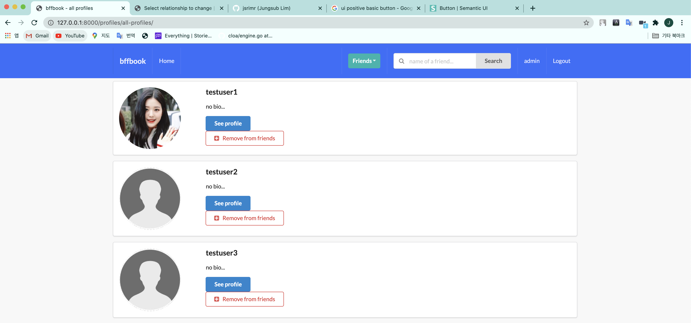

# FacebookLikeAPP using DJANGO



## Quickstart
```
python manage.py runserver
```
## Urls
```
path('profiles/', include('profiles.urls', namespace='profiles')),
path('posts/', include('posts.urls', namespace='posts')),
```

## Model
```
Users, Relationship, Likes, Posts
```

## Following this class
https://www.youtube.com/watch?v=ozr6NEomLQw&list=PLgjw1dR712joFJvX_WKIuglbR1SNCeno1